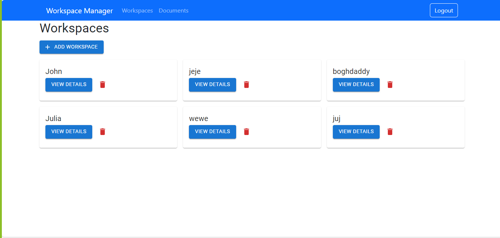
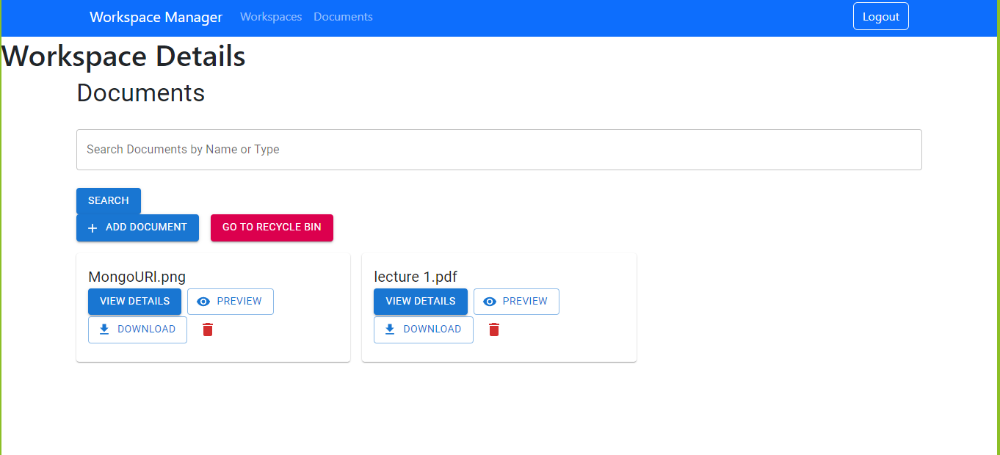
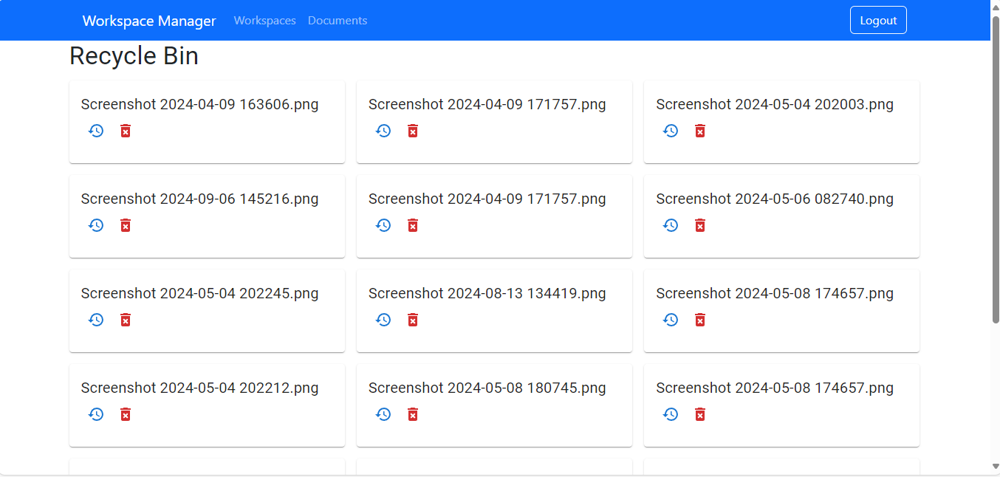

# 📁✨ Atos Project: Document Management System 🌐💼

Welcome to the **Atos Project**! This is a **Document Management System** built using the **MERN stack** (MongoDB, Express, React, Node.js). 🚀 It was created during my Full Stack MERN internship at **Atos** to provide a powerful yet simple solution for managing documents. 

## 🌟 Features

- 🔒 **User Authentication**: Secure login with password encryption using `bcrypt` 🛡️.
- 🗂️ **Document Management**: Upload, preview, download, and delete documents effortlessly.
- 🗑️ **Recycle Bin**: Soft-delete documents and restore them from the recycle bin.
- 🔍 **Search**: Quickly search documents using keywords.
- 📝 **Access Control**: Manage permissions (READ, WRITE, DELETE, SHARE) for each document.
- 🎯 **Responsive UI**: Built with **Material-UI** for an intuitive and modern user experience.

## ⚙️ Technologies Used

| Stack         | Technology          |
| ------------- | ------------------- |
| **Frontend**  | React, Material-UI, Axios |
| **Backend**   | Node.js, Express, JWT (for auth), Bcrypt |
| **Database**  | MongoDB (Mongoose ODM) |
| **Other**     | Nodemon, Validator, Multer |

## 🛠️ Installation & Setup

To run this project locally, follow these steps:

1. **Clone the repository**:
   ```bash
   git clone https://github.com/JuliaJohn01/atos_project.git
   ```
2. **Install dependencies** for both the client and server:
   ```bash
   cd atos_project
   npm install          # for the server
   cd client
   npm install          # for the React frontend
   ```
3. **Start the development server**:
   ```bash
   npm run dev          # runs both frontend and backend in dev mode
   ```

> Make sure you have **MongoDB** running locally or provide a connection string for MongoDB Atlas in your `.env` file. 

## 🚀 API Endpoints

- **POST** `/api/auth/signup` – Register a new user
- **POST** `/api/auth/login` – User login
- **GET** `/api/documents` – Get all documents
- **POST** `/api/documents` – Upload a new document
- **PATCH** `/api/documents/:id` – Edit document metadata
- **DELETE** `/api/documents/:id` – Soft-delete a document

## 📦 Project Structure

```bash
atos_project/
├── client/               # React Frontend
├── server/               # Express Backend
├── models/               # Mongoose Models
├── routes/               # Express Routes
├── controllers/          # Controller logic for API
├── .env                  # Environment variables
└── README.md             # Project documentation (you're here!)
```

## 📸 Screenshots

  
_A sleek and intuitive dashboard for managing documents._

  
_A sleek and intuitive view documents._

  
_The recycle bin feature allowing easy restoration of deleted files._

## 💻 Contributing

Contributions are welcome! Feel free to open an issue or submit a pull request. 💡

## 📝 License

This project is licensed under the **MIT License**. 📜

---

Give it a ⭐ if you like it, and let's manage documents in style! 😎

